# Overview
This is my UCSB CMPSC180 Assignments. Topics include vectors, matrix, model-view-projection, rasterization, shader, texture, animation etc.

Dependency libraries are:
**Eigen**
**openCV**
**openGL**

# Usage
basically most projects contain CMakeLists.txt, you need run:
```

mkdir build
cd build
cmake ..
make
```
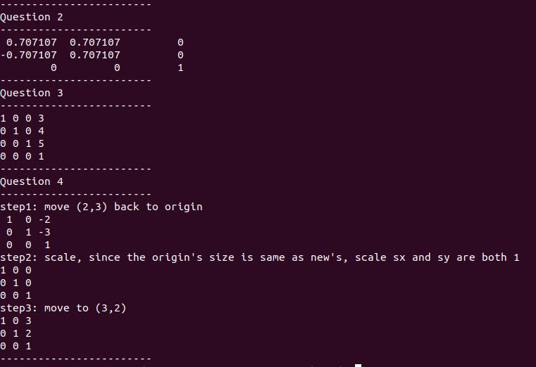
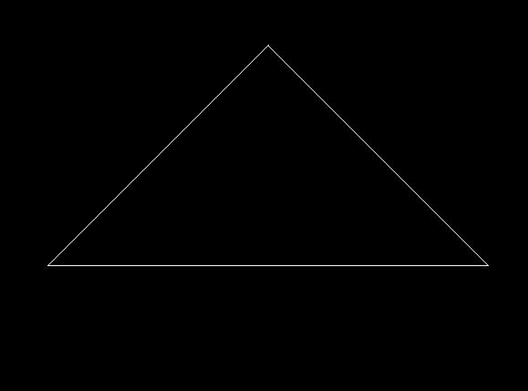
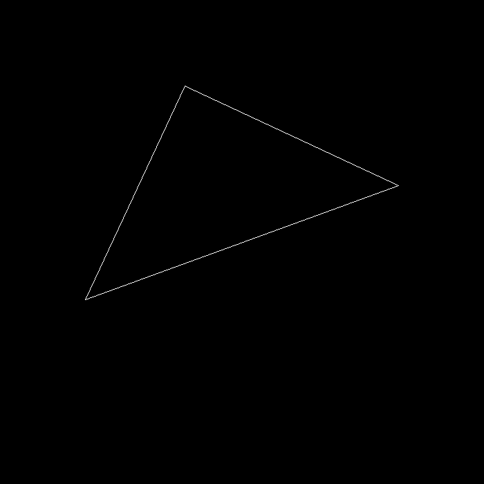
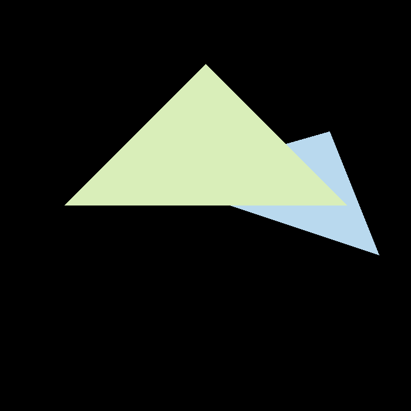
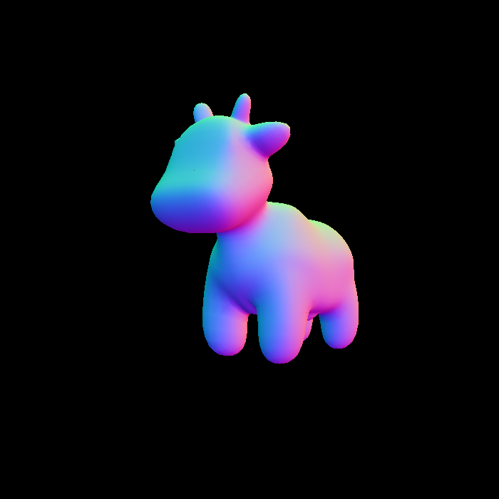
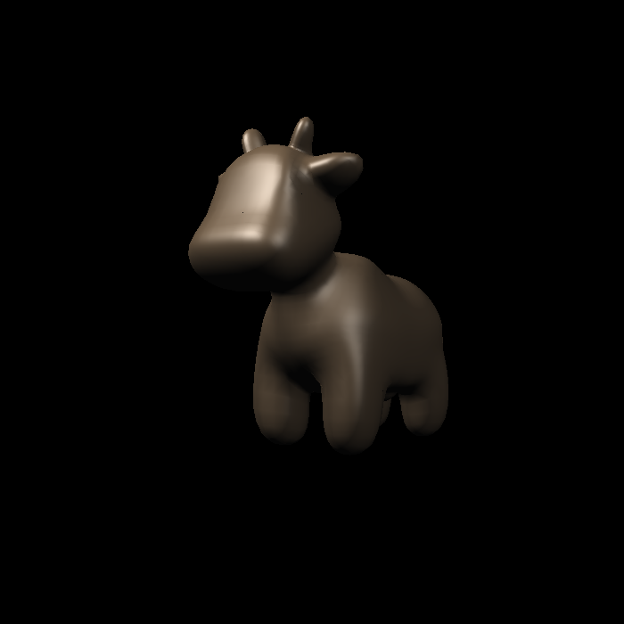
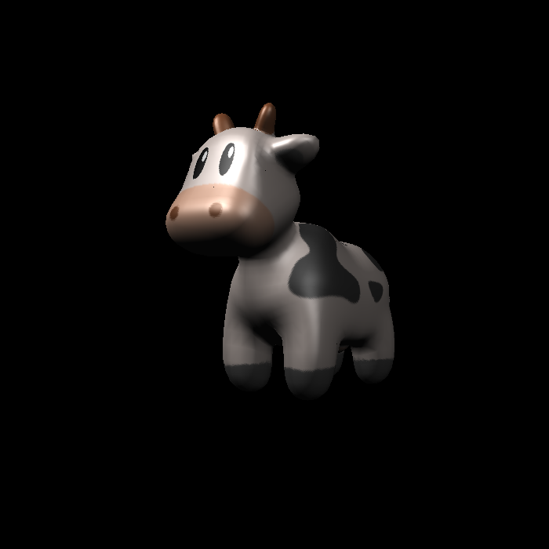
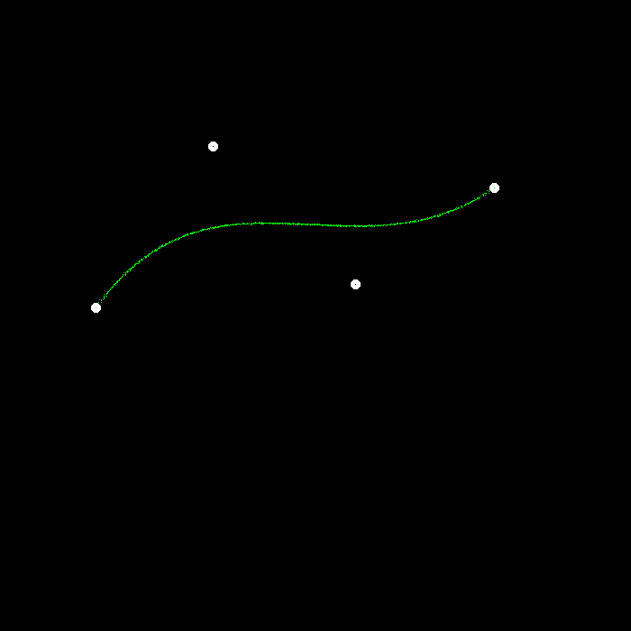
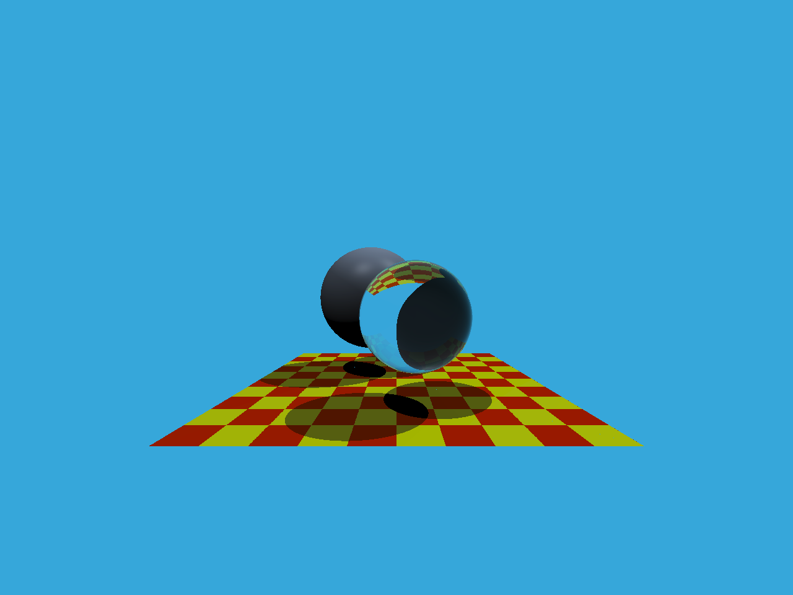
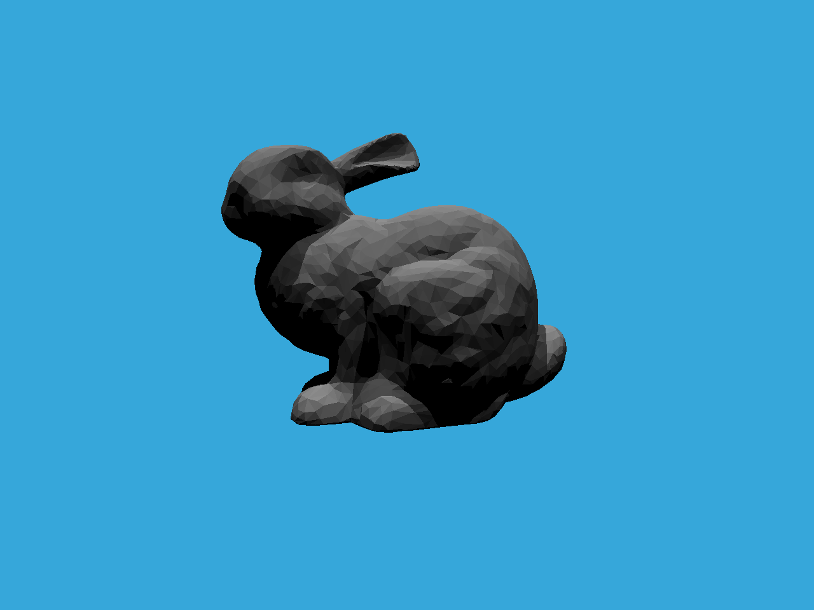
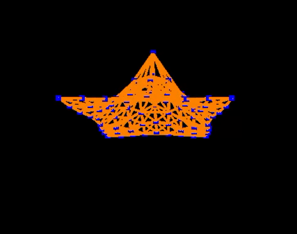
